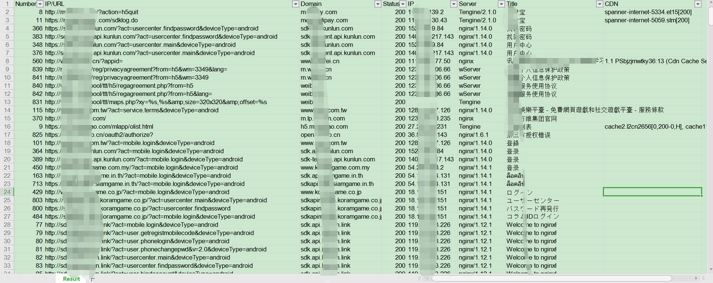

    [](http://hits.dwyl.com/kelvinBen/kelvinBen/AppInfoScanner)


**语言/Language**: [简体中文](README.md) | [English](README_EN.md)

该项目目前仅仅是规划项目中的冰山一角，如果您对此项目感兴趣或者想参与后续项目的开发工作或者翻译工作中，请发送邮件至[blsm@vip.qq.com](mailto:blsm@vip.qq.com)说明你的能力和诉求。

## AppInfoScanner

一款适用于以HW行动/红队/渗透测试团队为场景的移动端(Android、iOS、WEB、H5、静态网站)信息收集扫描工具，可以帮助渗透测试工程师、攻击队成员、红队成员快速收集到移动端或者静态WEB站点中关键的资产信息并提供基本的信息输出,如：Title、Domain、CDN、状态信息等。

## 前言
- 本项目的开发者目前为个人开发者同时有自己的工作，新的功能或者需求会在闲暇时间进行开发，BUG会优先进行处理。
- 如果在使用中遇到问题或者有新的需求，请在 [issues](https://github.com/kelvinBen/AppInfoScanner/issues) 提交BUG反馈，提交BUG前请先阅读最后的"常见问题"。
- 如果您觉得这个项目对您有用，请点击本项目右上角的"star"按钮。
- 如果您想持续跟进新的版本情况，请点击本项目右上角的"Watch"按钮。
- 如果您想参与本项目的开发，请点击本项目右上角的"Fork"按钮,否则请勿点击"Fork"按钮。

## 免责声明
请勿将本项目技术或代码应用在恶意软件制作、软件著作权/知识产权盗取或不当牟利等**非法用途**中。实施上述行为或利用本项目对非自己著作权所有的程序进行数据嗅探将涉嫌违反《中华人民共和国刑法》第二百一十七条、第二百八十六条，《中华人民共和国网络安全法》《中华人民共和国计算机软件保护条例》等法律规定。本项目提及的技术仅可用于私人学习测试等合法场景中，任何不当利用该技术所造成的刑事、民事责任均与本项目作者无关。

## 适用场景
- 日常渗透测试中对APP进行关键资产信息收集，比如URL地址、IP地址、关键字等信息的采集等。
- 大型攻防演练场景中对APP进行关键资产信息收集，比如URL地址、IP地址、关键字等信息的采集等。
- 对WEB网站源代码进行信息采集(可以是开源代码，也可以是网页另存为的源代码)。
- 对H5页面进行URL地址、IP地址、关键字等信息进行采集等。
- 对某个APP进行定向信息收集等

## 功能介绍:
- [x] 支持目录级别的批量扫描
- [x] 支持 DEX、APK、IPA、Mach-O、HTML、JS、Smali 等文件的信息收集
- [x] 支持 APK、IPA、H5 等文件自动下载并进行一键信息收集
- [x] 支持自定义请求头、请求报文、请求方法
- [x] 规则自定义: 工作区 config.toml
- [x] 支持自定义忽略资源文件
- [x] Android 加固检测: 加固厂商统一特征库识别与检测
- [x] CVE/RCE 组件检测: 支持 20 项 Android 应用 和 22 项 iOS 应用 CVE 和 RCE 组件的检测
- [x] 敏感权限检测: 支持 49 项 Android 应用 和 22 项 iOS 应用高敏感权限的检测
- [x] 敏感凭据(AK/SK)检测: 全面覆盖阿里云/腾讯云/AWS/Google/GitHub/GitLab/Slack/Stripe/JWT/私钥/URL内嵌密码等通用凭据的检测
- [x] 个人/企业敏感信息检测: 支持 手机号/身份证/邮箱/银行卡/车牌/姓名/统一社会信用代码等敏感信息的检测
- [x] 常见协议采集: 支持 http(s)/ws/jdbc/redis/mysql 等常用协议的采集
- [x] 基础网络嗅探: 支持状态码/标题/Server/CDN/解析IP等基础信息的嗅探
- [x] 多输出类别文件: 支持 json、txt、xlsx 等结果文件的输出
- [x] 国际化支持: 根据系统语言自动输出 中文/English 等语言提示
- [x] 适配 Windows/macOS/Linux 等主流操作系统
- [ ] 指纹识别模块(Web框架/CDN/WAF/CMS)
- [x] 支持APK文件魔数的自动修复
- [ ] 脱壳自动化增强
- [ ] ELF/.so 与 Flutter(libapp.so) 解析、支持鸿蒙/澎湃OS 等安装包的解析

## 部分截图



## 环境说明
- Python 3.11+ 运行环境(3.14 验证通过)
- 依赖工具链及版本(缺失时 macOS/Linux 自动安装，Windows 使用仓库自带二进制或手动安装):

| 工具 | 版本 | 获取方式 |
| --- | --- | --- |
| Java | 11+(Zulu 11 验证) | Windows 手动安装；macOS/Linux 经 brew/apt 等自动安装 |
| adb | platform-tools 当前版 | Windows 随仓库 tools/unpacker；macOS/Linux 触发脱壳时自动安装 |
| frida | 17.18.0 | pip 安装，与设备端 frida-server 版本保持一致 |
| frida-tools | 14.10.4 | pip 安装 |
| frida-dexdump | 2.0.1 | pip 安装 |
| apktool | 3.0.3 | 随仓库 tools/apktool.jar，工作区自动部署 |
| baksmali | 2.5.2-dev | 随仓库 tools/baksmali.jar |
| smali | 3.0.9-dev | apktool 内置(重建 dex 时使用) |

## 目录说明
```
AppInfoScanner
    |-- libs  程序的核心代码
        |-- core
            |-- __init__.py 全局配置与工作区/日志初始化(Bootstrapper)
            |-- default_config.py 内置默认配置与 config.toml 生成/迁移
            |-- parses.py 静态信息解析与提取(过滤规则/AK/PII)
            |-- report.py 结果分类聚合与 json/txt/xlsx 报告输出
            |-- download.py 文件自动下载
            |-- net.py 网络嗅探
            |-- i18n.py 多语言提示
            |-- provision.py 工具链自动安装与 frida 版本一致性
            |-- fix_magic.py dex/zip/AndroidManifest 魔数检测与修复
        |-- task
            |-- base_task.py 统一任务调度中心
            |-- android_task.py Android 相关任务
            |-- ios_task.py iOS 相关任务
            |-- web_task.py Web/H5 相关任务
            |-- net_task.py 网络嗅探任务
            |-- download_task.py 自动下载任务
    |-- tools 程序需要依赖的第三方工具
        |-- apktool.jar / baksmali.jar 反编译工具
        |-- strings.exe / strings64.exe Windows 下提取字符串
        |-- unpacker Windows 脱壳工具(adb/aapt/frida-server)
    |-- tests 单元测试(python3 -m unittest discover -s tests)
    |-- app.py 主运行程序
    |-- requirements.txt 依赖清单(显式版本)
    |-- README.md / README_EN.md 使用说明(中英)
    |-- update.md / update_EN.md 版本历史(中英)
```

## 使用说明

1. 下载
```
    git clone https://github.com/kelvinBen/AppInfoScanner.git
    
    或者复制以下链接到浏览器下载最新正式版本
    
    https://github.com/kelvinBen/AppInfoScanner/releases/latest

    国内快速下载通道:

    git clone https://gitee.com/kelvin_ben/AppInfoScanner.git

```

2. 安装依赖库
```
    cd AppInfoScanner
    python -m pip install -r requirements.txt
```

3. 运行(基础版)

- 扫描Android应用的APK文件、DEX文件、需要下载的APK文件下载地址、保存需要扫描的文件的目录

```
    python app.py android -i <APK/DEX 文件或下载地址或目录>
    (English: python app.py android -i <Your APK File or DEX File or APK Download Url or Save File Dir>)
```

- 扫描iOS应用的IPA文件、Mach-o文件、需要下载的IPA文件下载地址、保存需要扫描的文件目录

```
    python app.py ios -i <IPA/Mach-O 文件或下载地址或目录>
    (English: python app.py ios -i <Your IPA file or Mach-o File or IPA Download Url or Save File Dir>)
```

- 扫描Web站点的文件、目录、需要缓存的站点URL

```
    python app.py web -i <站点文件或目录或URL地址>
    (English: python app.py web -i <Your Web file or Save Web Dir or Web Cache Url>)
```

## 进阶操作指南

### 基本命令格式
```
python app.py [TYPE] [OPTIONS] <扫描的文件或目录或URL地址>
(English: <The URL or directory to scan>)
```

### 符号信息说明

```
<> 代表需要扫描的文件或者目录或者URL地址
| 或的关系，只能选择一个
[] 代表需要输入的参数
```

### TYPE参数详细说明
对应基本命令格式中的 [TYPE]，目前仅支持 android/ios/web 三种类型，必须指定其一。

```
android: 用于扫描Android应用相关的文件的内容
ios: 用于扫描iOS应用相关的文件内容
web: 用于扫描WEB站点或者H5相关的文件内容
```

支持自动根据后缀名称进行修正，即便输入的是ios，实际上-i 输入的参数的文件名为XXX.apk，则会执行android相关的扫描。


### OPTIONS参数详细说明
对应基本命令格式中的 [OPTIONS]，支持多个参数组合使用。

```
-i 或者 --inputs: 输入需要进行扫描的文件、目录或者需要自动下载的文件URL地址，路径过长时请用双引号(")包裹，此参数为必填项。
-r 或者 --rules: 输入需要扫描文件内容的临时扫描规则。
-s 或者 --sniffer: 关闭网络嗅探功能，默认为开启状态。
-n 或者 --no-resource: 忽略所有的资源文件，包含网络嗅探功能中的资源文件(需要先在工作区config.toml中配置sniffer_filter相关规则)，默认为不忽略资源。
-a 或者 --all: 逐条输出命中的内容(详细模式)，默认仅输出汇总。
-t 或者 --threads: 设置线程并发数量，默认为10个线程并发。
-o 或者 --output: 指定扫描结果和扫描过程中产生的临时文件的输出目录，默认为用户文档目录下的AppInfoScanner目录(如 macOS/Linux 的 ~/Documents/AppInfoScanner、Windows 的 C:\Users\<用户名>\Documents\AppInfoScanner)；若用户文档目录不存在则使用用户主目录下的AppInfoScanner目录(如 /home/<用户名>/AppInfoScanner)。
-p 或者 --package: 指定Android的APK文件或者DEX文件需要扫描的JAVA包名信息。此参数只能在android类型下使用。
```

### 具体使用方法

#### Android相关基本操作
- 对本地APK文件进行扫描
```
python app.py android -i <Your apk file>  

例:

python app.py android -i  C:\Users\Administrator\Desktop\Demo.apk
```

- 对本地Dex文件进行扫描
```
python app.py android -i <Your DEX file>  

例:

python app.py android -i  C:\Users\Administrator\Desktop\Demo.dex

```
- 对URL地址中包含的APK文件进行扫描
```
python app.py android -i <APK Download Url>  

例:

python app.py android -i "https://127.0.0.1/Demo.apk" 

```
需要注意此处如果URL地址过长需要使用双引号(")进行包裹

#### iOS相关基本操作
- 对本地IPA文件进行扫描
```
python app.py ios -i <Your ipa file>

例:

python app.py ios -i "C:\Users\Administrator\Desktop\Demo.ipa" 
```

- 对本地Macho文件进行扫描
```
python app.py ios -i <Your Mach-o file>

例:

python app.py ios -i "C:\Users\Administrator\Desktop\Demo\Payload\Demo.app\Demo" 
```

- 对URL地址中包含的IPA文件进行扫描
```
python app.py ios -i <IPA Download Url>  

例:

python app.py ios -i "https://127.0.0.1/Demo.ipa" 

```
需要注意此处如果URL地址过长需要使用双引号(")进行包裹,暂时不支持对App Store中的IPA文件进行扫描

#### Web相关基本操作

- 对本地WEB站点进行扫描
```
python app.py web -i <Your web file>

例:

python app.py web -i "C:\Users\Administrator\Desktop\Demo.html" 
```
- 对URL地址中包含的WEB站点文件进行扫描
```
python app.py web -i <Web Download Url>  

例:

python app.py web -i "https://127.0.0.1/Demo.html" 

```

#### 具有共同性的操作

以下操作均以android类型为例：

- 对一个本地的目录进行扫描
```
python app.py android -i <Your Dir>

例：

python app.py android -i C:\Users\Administrator\Desktop\Demo
```

- 添加临时规则或者关键字

```
python app.py android -i <Your apk> -r <the keyword | the rules>

例：
添加对百度域名的扫描

python app.py android -i C:\Users\Administrator\Desktop\Demo.apk -r ".*baidu.com.*"
```

- 关闭网络嗅探功能
```
python app.py android -i <Your apk> -s

例：
python app.py android -i C:\Users\Administrator\Desktop\Demo.apk -s

```
- 忽略所有的资源文件
```
python app.py android -i <Your apk> -n

例：
python app.py android -i C:\Users\Administrator\Desktop\Demo.apk -n

```

- 开启详细输出(逐条显示命中内容)
```
python app.py android -i <Your apk> -a

例：

python app.py android -i C:\Users\Administrator\Desktop\Demo.apk -a
```

- 设置并发数量
```
python app.py android -i <Your apk> -t 20

例：
设置20个并发线程
python app.py android -i C:\Users\Administrator\Desktop\Demo.apk -t 20 
```
- 指定结果集和缓存文件输出目录
```
python app.py android -i <Your apk> -o <output path>

例：
比如输出到桌面的Temp目录
python app.py android -i C:\Users\Administrator\Desktop\Demo.apk -o C:\Users\Administrator\Desktop\Temp
```

- 对指定包名下的文件内容进行扫描，该功能仅支持android类型

```
python app.py android -i <Your apk> -p <Java package name>

例：
比如需要过滤com.baidu包名下的内容

python app.py android -i C:\Users\Administrator\Desktop\Demo.apk -p "com.baidu"
```

## 高级版使用说明
内置规则有限，并非所有输入都能得到理想结果；可根据需要在 config.toml 中调整规则，合理的规则配置可以显著提升检索质量。


- 配置文件为 TOML 格式，首次运行时自动部署到用户文档目录的AppInfoScanner目录下(如 ~/Documents/AppInfoScanner/config.toml)，带中文注释说明，可直接编辑，下次运行即生效；删除该文件后重新运行即可恢复默认配置。
- 旧版本工作区中的 config.py 会在升级后首次运行时自动迁移为 config.toml，原文件保留为 config.py.bak。
- 规则写法说明：TOML 单引号字符串(字面量串)中反斜杠原样生效，适合正则规则，如 '.*accessKeyId.*".*?"'；仅当规则中包含单引号时才需要改用双引号字符串并对反斜杠双写。

### 配置项说明
```
apk_permissions: Android敏感权限表(manifest声明 -> 中文风险说明)，命中后以 '权限 (说明)' 输出
ios_permissions: iOS隐私权限表(Info.plist声明键 -> 中文风险说明)，扫描IPA时自动解析 .app/Info.plist 检测
filter_components: Android组件识别表(包名片段 -> 组件与风险说明)，聚焦存在RCE/CVE的组件: fastjson/Log4j(Log4Shell)/Shiro/XStream/CommonsCollections反序列化链/Struts2/SnakeYAML/XXE系/BouncyCastle/Netty等
ios_components: iOS组件识别表(标记串 -> 组件与风险说明)，含SSZipArchive(Zip-Slip)/OpenSSL/libxml等高危组件、AFNetworking/微信/极光等常见SDK与FLEX调试工具，按二进制strings内容匹配
filter_strs: 提取内容规则(正则)，默认覆盖常见协议地址、IPv4/IPv6 与本地回环服务
filter_no: 忽略规则(正则)，默认仅含保留地址段(0.x/广播地址/文档示例网段/::1)
filter_no_domains: 公共域名后缀表,命中 host 或其任意父域后缀即忽略(如 w3.org 覆盖 www.w3.org;bugly.qq.com 只覆盖自身及子域,不连坐 qq.com)。新增公共域名时写裸域名即可,无需 .* 前缀
shell_vendors: Android加固统一特征库(厂商 -> {classes: application类名, so: so文件特征, assets: assets文件特征})；三路检测：① manifest application 类名先行判断(门控)，命中厂商后用该厂商文件特征确认；② 经验规则：应用包名在 dex 包结构中缺失即疑似加固(壳加密业务dex)，此时跨厂商扫签名定位；特征确认成功触发自动脱壳
web_file_suffix: web扫描的文件后缀(大小写不敏感)，含html/js/ts/vue/source map/css/服务端模板/配置文件(json/yaml/env等)与小程序文件(wxml/wxss)
sniffer_filter: 网络嗅探忽略的文件后缀(静态资源/二进制:图片/字体/音视频/文档/压缩包/安装包等,共50+类,仅 -n 时生效)
headers: 用于配置自动下载过程中需要的请求头信息
data: 用于配置自动下载过程中需要的请求报文体
method: 用于配置自动下载过程中需要的请求方法
```

## 常见问题

###  1. 信息检索垃圾数据过多？

```
方法1： 根据实际情况调整工作区config.toml中的规则信息
方法2： 忽略资源文件
```

### 2. 出现错误：Error: This application has shell, the retrieval results may not be accurate, Please remove the shell and try again!

说明需要扫描的应用存在壳，需要进行脱壳/砸壳以后才能进行扫描，目前可以结合以下工具进行脱壳/砸壳处理
```
    
    Android:
        xposed模块： dexdump
        frida模块： FRIDA-DEXDump
        无Root脱壳：blackdex
    iOS:
        frida模块：
            windows系统使用： frida-ipa-dump
            MacOS系统使用：frida-ios-dump
```

### 3. 出现错误: File download failed! Please download the file manually and try again.

文件下载失败。
```
1) 请检查输入的URL地址是否正确
2）请检查网络是否存在问题或者在工作区配置文件config.toml中配置请求头信息(headers)、请求报文体(data)、请求方法(method)保存后重新再执行。
```
### 4. 出现错误：Decompilation failed, please submit error information at https://github.com/kelvinBen/AppInfoScanner/issues"

文件反编译失败。

```
请将错误截图以及对应的APK文件提交至 https://github.com/kelvinBen/AppInfoScanner/issues，作者看到后会及时进行处理。
```
## 自定义规则添加

自定义规则提交路径：

[点击添加自定义规则](https://github.com/kelvinBen/AppInfoScanner/issues/7)

提交格式：
```
1. APP自定义组件添加

如： fastjson的规则如下：
APP组件: fastjson com.alibaba.fastjson

2. 需要进行搜索的字符串

如：查询阿里的AK规则如下:
字符串: 
阿里云AK .*accessKeyId.*".*"

3. 需要搜索的web文件后缀名

如：jsp文件的规则如下：
网站： java语言 jsp

4. Android壳规则
如： 某数字公司的壳规则如下：
壳：某数字公司 com.stub.StubApp

```

## 联系作者

**微信**：bromomo (添加好友请备注：GitHub)

**微信群**：


如无法加入请添加微信好友后进群。

**邮箱**：[blsm@vip.qq.com](mailto:blsm@vip.qq.com)

提交需求、提交BUG修复、技术交流、商务合作均可添加作者好友。

## Stargazers over time
[](https://starchart.cc/kelvinBen/AppInfoScanner)

## 404StarLink 2.0 - Galaxy


AppInfoScanner 是 404Team [星链计划2.0](https://github.com/knownsec/404StarLink2.0-Galaxy)中的一环，如果对AppInfoScanner 有任何疑问又或是想要找小伙伴交流，可以参考星链计划的加群方式。

[https://github.com/knownsec/404StarLink2.0-Galaxy#community](https://github.com/knownsec/404StarLink2.0-Galaxy#community)
